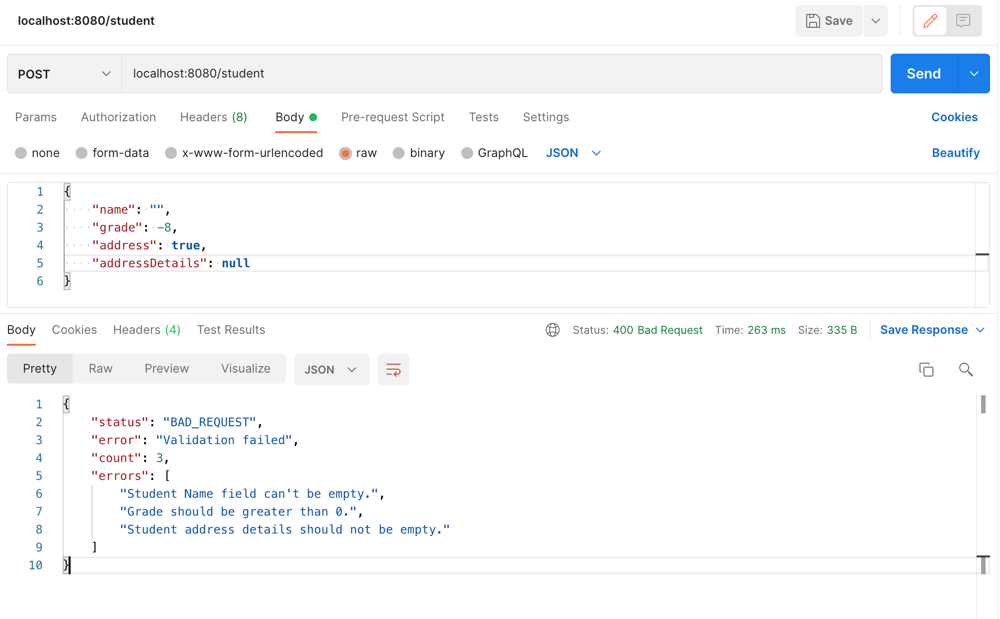
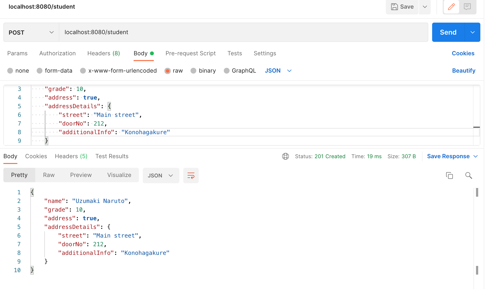

# spring-validation-with-init-binder

### Things todo list

1. Clone this repository: `git clone https://github.com/hendisantika/spring-validation-with-init-binder.git`
2. Navigate to the folder: `cd spring-validation-with-init-binder`
3. Run the application: `mvn clean spring-boot:run`
4. Open your POSTMAN

### Image Screen shot

Validate Error

Validation OK

